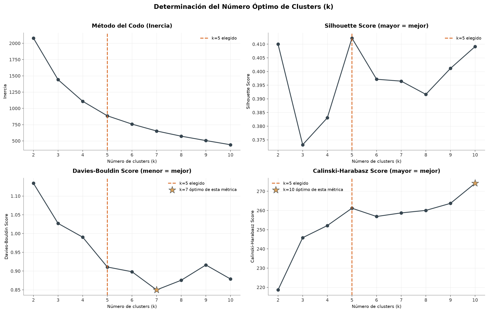
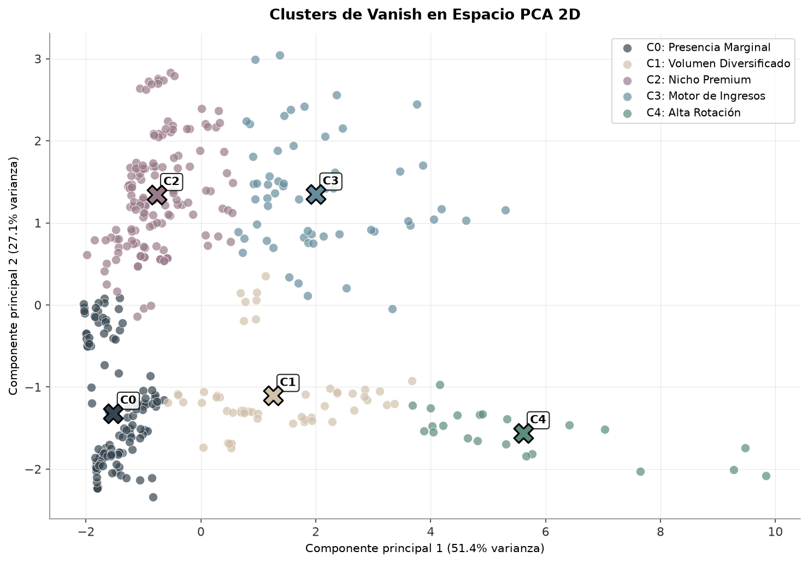
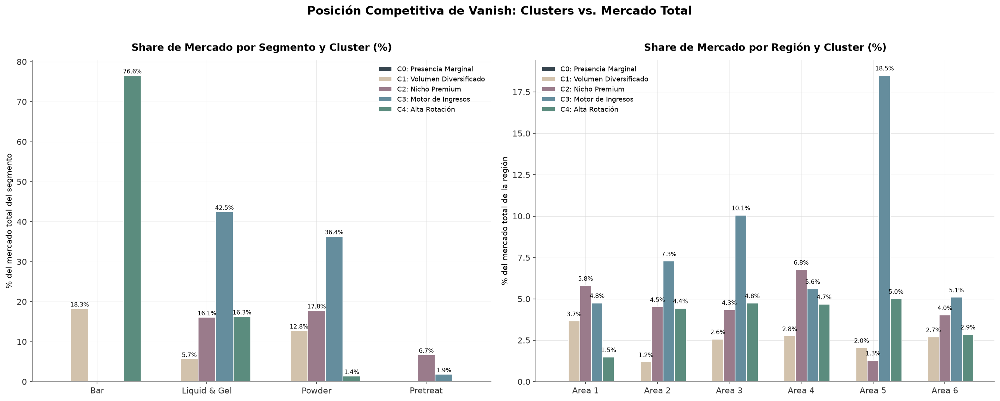

#  K-Means Clustering: Vanish Market Segmentation
### Segmentación de Mercado con K-Means de la Marca Vanish

> **EN** · Unsupervised machine learning project applying K-Means clustering to identify internal market segments within the Vanish brand portfolio, validated with three cluster-quality metrics and cross-referenced against total market share to reveal each segment's real competitive role.
>
> **ES** · Proyecto de machine learning no supervisado que aplica K-Means para identificar segmentos internos dentro del portafolio de la marca Vanish, validado con tres métricas de calidad de cluster y cruzado contra el market share total para revelar el rol competitivo real de cada segmento.

---

##  Overview / Descripción

**EN** · This project continues the [ETL pipeline](https://github.com/ReginaPema/etl-sales-data-cleaning) and [EDA](https://github.com/ReginaPema/eda-retail-sales-analysis) of the same retail sales dataset. It segments **Vanish**, the second brand of the portfolio by sales (19.6% of total revenue), into internal clusters by product-region combination (23,626 weekly records → 402 aggregated combinations), to understand which parts of the brand's footprint actually drive its market position.

**ES** · Este proyecto continúa el [pipeline ETL](https://github.com/ReginaPema/etl-sales-data-cleaning) y el [EDA](https://github.com/ReginaPema/eda-sales-analysis) del mismo dataset de ventas retail. Segmenta a **Vanish**, la segunda marca del portafolio por ventas (19.6% del ingreso total), en
clusters internos por combinación producto-región (23,626 registros semanales → 402 combinaciones agregadas), para entender qué partes de la presencia de la marca realmente sostienen su posición de mercado.

---

##  Modeling Highlights / Hallazgos del Modelado

**EN** ·

- **The national aggregate excluded.** The dataset includes a `Total Nacional` row that is the sum of the six regional areas, if included as a seventh region, its inflated values (sums, not individual sales) would pull the clustering toward that artifact instead of genuine business patterns. Every aggregation here works only on the six regional areas.
- **k chosen with four lines of evidence.** The elbow method, Silhouette Score, Davies-Bouldin Index and Calinski-Harabasz Index are evaluated together across k=2 to 10; k=5 is where the majority of signals converge (Silhouette peaks cleanly at 0.412, Calinski-Harabasz forms a genuine local peak) while remaining small enough to stay business-interpretable.
- **A feature dropped for being a duplicated average.** One candidate rotation feature was itself already a rolling average computed upstream; using it would have meant averaging an average. It was replaced with a direct mean of actual weekly units sold, avoiding a subtle but real distortion.
- **Clusters cross-checked against real market share.** Each cluster's contribution to Vanish's segment- and region-level market share is computed directly, revealing that the brand's 94.9% share of the Bar segment rests on two clusters with opposite strategies (a handful of extreme-rotation SKUs and a broader base of moderately fast movers), and that two of the five clusters show an inverse geographic relationship worth investigating further.

**ES** ·

- **El total nacional excluido.** El dataset incluye una fila `Total Nacional` que es la suma de las seis áreas regionales, si se incluyera como una séptima región, sus valores inflados (sumas, no ventas individuales) jalarían el clustering hacia ese artefacto en vez de patrones de negocio genuinos. Toda agregación aquí trabaja solo sobre las seis áreas regionales.
- **k elegido con cuatro líneas de evidencia.** El método del codo, Silhouette Score, Davies-Bouldin Index y Calinski-Harabasz Index se evalúan juntos entre k=2 y 10; k=5 es donde converge la mayoría de las señales (Silhouette alcanza su máximo limpio en 0.412, Calinski-Harabasz forma un pico local genuino) sin dejar de ser interpretable para negocio.
- **Una variable descartada por ser un promedio duplicado.** Una candidata a variable de rotación ya era, en sí misma, un promedio móvil calculado; usarla habría significado promediar un promedio. Se reemplazó por el promedio directo de unidades realmente vendidas por semana, evitando una distorsión sutil pero real.
- **Clusters cruzados contra el market share real.** La contribución de cada cluster al share de Vanish por segmento y región se calcula de forma directa, revelando que el 94.9% de share de la marca en Bar descansa sobre dos clusters de estrategia opuesta (pocos SKUs de rotación extrema y una base más amplia de rotación moderada), y que dos de los cinco clusters muestran una relación geográfica inversa que amerita más investigación.

---

##  Tools / Herramientas

---

##  Analysis / Análisis

| Section / Sección | Covers / Cubre |
|---|---|
| Feature engineering / Ingeniería de características | Aggregation by product-region, 8 standardized features |
| Optimal k / k óptimo | Elbow, Silhouette, Davies-Bouldin, Calinski-Harabasz across k=2–10 |
| Final model / Modelo final | K-Means (k=5, k-means++, 50 initializations) |
| Cluster profiling / Perfilado de clusters | Centroids, PCA 2D, heatmap, boxplots |
| Composition / Composición | Segment and region breakdown per cluster |
| Competitive position / Posición competitiva | Vanish vs. total market, clusters vs. market share |
| Executive insights / Insights ejecutivos | Per-cluster strengths, cross-cutting patterns, recommendations |

---

##  Results / Resultados

**Validation / Validación:** Silhouette = 0.412 · Davies-Bouldin = 0.911 · Calinski-Harabasz = 261.2

| Cluster | Name / Nombre | Share of Vanish Sales | Profile / Perfil |
|---|---|---|---|
| 3 | Motor de Ingresos | 46.4% | High price, solid real rotation, drives Liquid & Gel and Powder leadership |
| 2 | Nicho Premium | 21.3% | Highest price in the portfolio, minimal rotation, only relevant presence in Pretreat |
| 4 | Alta Rotación | 20.2% | Lowest price, highest rotation by far (only 5 unique SKUs), drives most of Bar's share |
| 1 | Volumen Diversificado | 12.0% | Low price, high rotation, broader product base behind Bar's leadership |
| 0 | Presencia Marginal | 0.2% | Largest group by record count, shortest temporal presence, main audit candidate |

---

##  Repository Structure / Estructura

    kmeans-vanish-segmentation/
    ├── notebook/
    │   └── kmeans_vanish_segmentation.ipynb
    ├── plots/                          # 8 exported visualizations
    ├── data/                           # Aggregated model outputs, not raw source data
    │   └── *.csv                       # 6 files: cluster assignments, summaries, market share
    ├── README.md
    └── requirements.txt                # Python libraries

---

*Project developed as part of the Data Scientist Certificate · 
Proyecto desarrollado como parte del certificado Científico de Datos — EBAC (2026)* 
